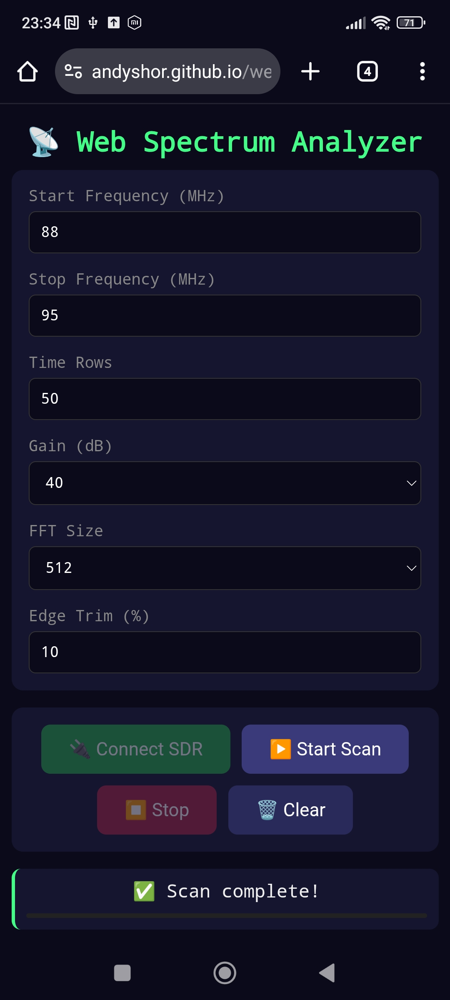

# Web Spectrum Analyzer

A browser-based wideband spectrum analyzer using RTL-SDR via WebUSB.

## Credits

- Uses [webrtlsdr](https://github.com/jtarrio/webrtlsdr) library for RTL-SDR access
- Inspired by [Radio Receiver](https://radio.ea1iti.es) by Jacobo Tarrío

  |  |  |


## Features

- **Wideband Scanning**: Scan frequency ranges wider than RTL-SDR's native bandwidth (up to ~1.7 GHz)
- **Waterfall Display**: Real-time spectrogram visualization with viridis colormap
- **Spectrum Plot**: Live power vs frequency graph
- **Edge Trimming**: Reduces artifacts at chunk boundaries
- **Configurable Parameters**: FFT size, gain, edge trim, time rows
- **PWA Support**: Installable as an app, works offline (after first load)
- **No Backend Required**: Runs entirely in the browser using WebUSB

## Requirements

- **Browser**: Chrome, Edge, or Opera (Chromium-based browsers with WebUSB support)
- **RTL-SDR**: RTL2832U-based dongle with R820T/R828D tuner
- **HTTPS**: Required for WebUSB (GitHub Pages provides this)
- **Driver**: Default Windows driver or no driver (NOT WinUSB)


## Usage

1. Click **Connect SDR** - browser will prompt for USB device
2. Select your RTL-SDR from the list
3. Set frequency range (24-1700 MHz)
4. Configure parameters:
   - **Time Rows**: Number of waterfall rows (more = longer capture)
   - **Gain**: 0-49.6 dB or Auto
   - **FFT Size**: Higher = finer frequency resolution
   - **Edge Trim**: Higher = cleaner chunk boundaries (10-15% recommended)
5. Click **Start Scan**
6. Adjust **Min/Max dB** to tune color scale

## Parameters

| Parameter | Description | Recommended |
|-----------|-------------|-------------|
| Start Freq | Lower frequency in MHz | 88 (FM band) |
| Stop Freq | Upper frequency in MHz | 108 (FM band) |
| Time Rows | Number of waterfall lines | 50-200 |
| Gain | Tuner gain in dB | 40 dB |
| FFT Size | Frequency bins per chunk | 1024 |
| Edge Trim | % to discard at chunk edges | 10% |
| Min dB | Color scale minimum | -50 |
| Max dB | Color scale maximum | 10 |

## File Structure

```
web-spectrum-analyzer/
├── index.html      # Main HTML page
├── app.js          # Application logic (FFT, scanning, rendering)
├── sw.js           # Service worker for offline support
├── manifest.json   # PWA manifest
└── README.md       # This file
```

## Browser Compatibility

| Browser | Support |
|---------|---------|
| Chrome | ✅ Yes |
| Edge | ✅ Yes |
| Opera | ✅ Yes |
| Firefox | ❌ No (no WebUSB) |
| Safari | ❌ No (no WebUSB) |


## License

Apache 2.0 license as per code of webrtlsdr

## ⚠️ Driver Note

If you've installed WinUSB via Zadig for other SDR software (like pyrtlsdr), you'll need to:

1. Open Device Manager
2. Find your RTL-SDR under "Universal Serial Bus devices"
3. Right-click → Uninstall device (check "Delete driver software")
4. Unplug and replug the dongle
5. Let Windows install the default driver

Alternatively, use a different USB port (Zadig installs per-port).

